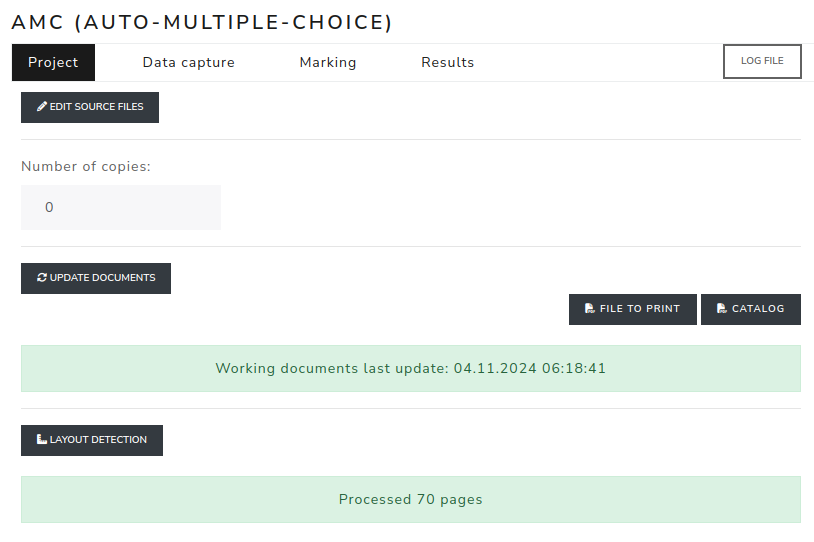
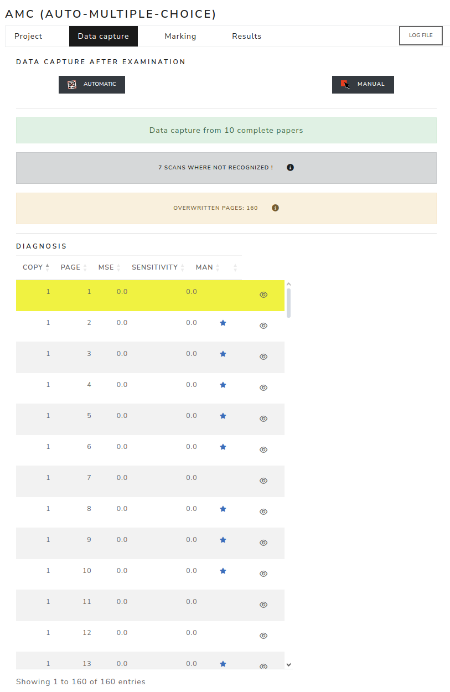
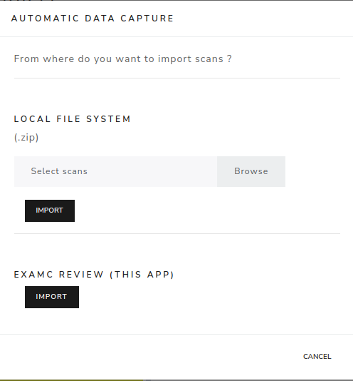
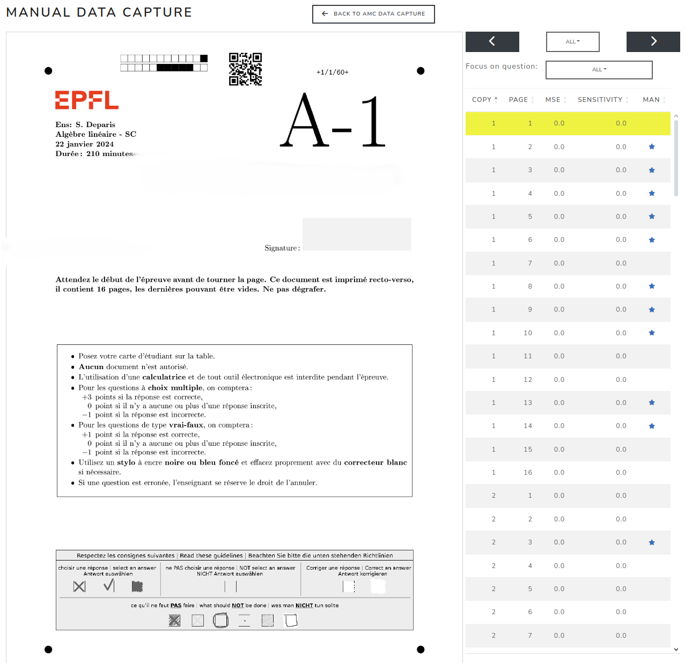
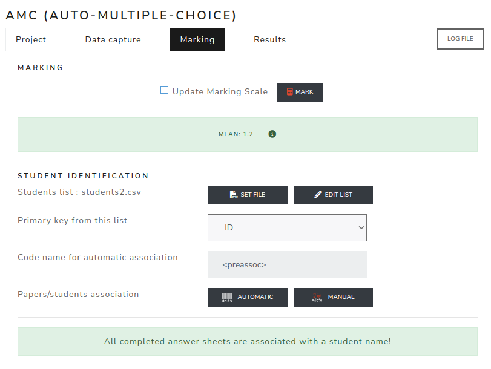
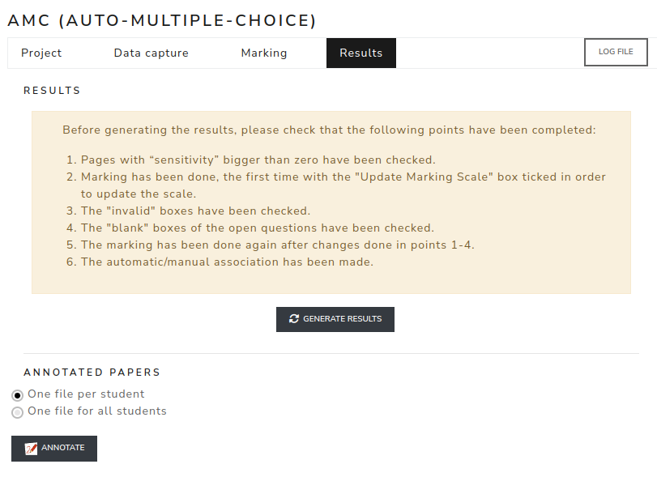

AMC application
===============

Project
-------

Open the **Project** tab first. This tab is used to prepare the AMC project before scans are imported.

You can:

- edit AMC source files;
- set the number of copies;
- run **Update documents**;
- open the file to print and the catalog;
- run **Layout detection**.

The project is ready when the update documents message and the layout detection message are successful.

.. screenshot TODO: Refresh so the current Project tab shows source editing, number of copies, update documents, PDFs and layout detection statuses.

Import the scans
----------------

Open the **Data capture** tab after the exam. It can import scans from a local ``.zip`` file or from eXamc Review.

When importing from Review, you can import all marked scans or select specific pages. This is useful when open questions were corrected in Review and the marked pages must be sent back to AMC for marking.

.. screenshot TODO: Refresh so the Data capture tab includes import-from-Review, diagnosis, missing/unrecognized/overwritten warnings.

#. Go to the **Data capture** tab.
#. Click **Automatic**.
#. Choose a local ``.zip`` file or import scans from Review.

.. screenshot TODO: Refresh so the Automatic Data Capture modal shows local zip import and Review import options.

The diagnosis table lists captured copy/page data, MSE, sensitivity and manual checks. Warning banners report missing pages, unrecognized scans and overwritten pages.

Check the boxes with the "sensitivity" setting
----------------------------------------------------

This step allows you to check the boxes (a trace in a box, a cross incorrectly erased, etc.).

#. Click on the "Manual" button.
#. Click on the "Sensibility" column twice to sort the copies to check.
#. Check all those with a value greater than 0. The software counts as checked all those with a red square. To deselect a box, click on it.

.. screenshot TODO: Refresh if the Manual Data Capture controls or filters changed.

Check the boxes with the "invalid" parameter
---------------------------------------------

Invalids are where students have selected multiple boxes for questions with only one correct answer (SCQ, True-false).

#. Click on the "Marking" tab.
#. Check the "Update marking scale" box.
#. Click on the "Mark" button.
#. Go back to the "Data capture" tab
#. Click on the "Manual" button.
#. Select the parameters: inv
#. Select / deselect the desired boxes and move to the next ones using the ">" button.

Check open questions for which no points have been awarded
-----------------------------------------------------------

'empty' is used to check whether all the boxes in a question are empty. You can use it to check that an open question has been forgotten.

From "Data capture" tab

#. Click on the "Manual" button.
#. Select the settings: empty.
#. Select the first ID of your open question to be checked.
#. Make sure you start checking by being on copy 1 page 1 and click the ">" button to move to the next copy where points are missing.
#. Correct the question and select the box to award the correct number of points.
#. Click the ">" button until the software finds nothing more.
#. Repeat this step for the other open questions

Calculate the results
----------------------

Open the **Marking** tab to compute marks and associate answer sheets with students.

#. Go back to the "Marking" tab.
#. Check the "Update marking scale" box.
#. Click on the "Mark" button.

.. screenshot TODO: Refresh so Marking shows update marking scale, marking details and student association controls.

Associate the students list
~~~~~~~~~~~~~~~~~~~~~~~~~~~

#. If the student CSV file must be replaced, click **Set file**.
#. Select the primary key from the student list.
#. Click **Automatic** to associate papers and students.
#. Use **Manual** to fix missing or incorrect associations.

Export the results
-------------------

Open the **Results** tab after marking and student association are complete.

#. Check the warning checklist before generating results.
#. Click **Generate Results** to populate the Results and Statistics modules.
#. Choose whether annotated papers are generated as one file per student or one file for all students.
#. When grading schemes are used, enable **Add grading scheme report with annotations** if the grading scheme report must be appended.
#. Click **Annotate**.

When annotated papers are available, they can be downloaded or sent by email.

.. screenshot TODO: Refresh so Results shows Generate Results, annotated papers, email sending and grading scheme report option.

