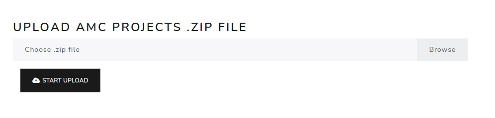

AMC import data
================

The **AMC -> Import data** page imports an AMC project into eXamc.

Upload the AMC project as a ``.zip`` file. The archive must contain the AMC project files needed for document generation, layout detection, scan capture and marking.

After import, open **AMC -> AMC**, then use the **Project** tab to update documents and run layout detection.

.. screenshot TODO: Refresh if the AMC project upload form or progress feedback changed.

