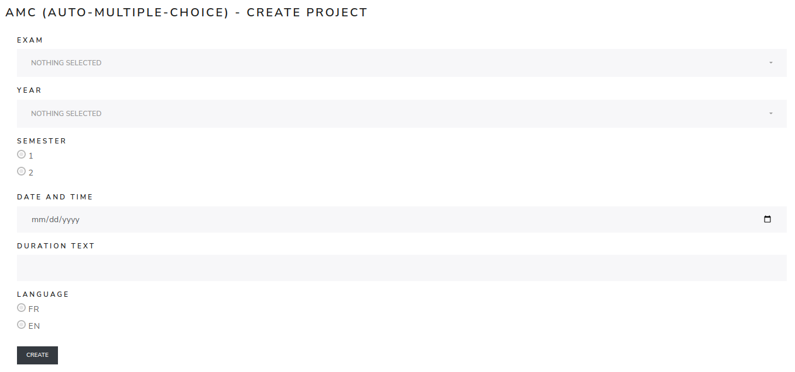

Create exam
============

The **Create exam** page creates a new exam project.

Select the course, year, semester, date and time, then click **create**. After creation, open **Exam Info** to review the exam settings, enable the required modules and add users.

This page is available to administrators.

.. screenshot TODO: Refresh if the create form fields or administrator-only messaging changed.

