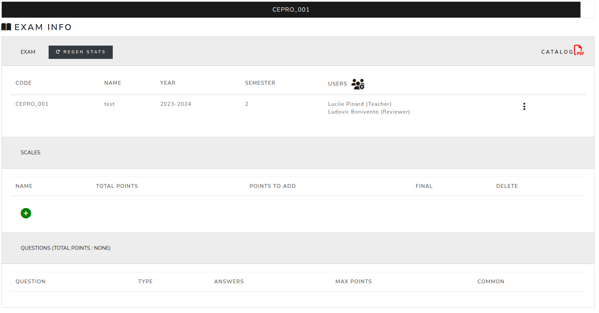
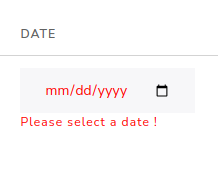

Exam info
============

This page is used to manage preferences of the exam and to have a global view of the stats.

First, a date should be added to the exam. After that, the date will be displayed in grey, which means that the date is correct.

By clicking on the 3 dots on the right hand side of the screen, you can manage which modules are displayed on the sidebar.

.. image:: images/exam_options.png
   :width: 600

By clicking on the users icon, you can manage users of the exam, by adding them as teachers, reviewers or assistants.
The search is done in the ldap database and in the app database, if the user is not an EPFL member, please contact the eXamc admin.

.. image:: images/manage_users.png
   :width: 600

The scale can be added by clicking on the green cross. First enter a name and then the number of points.
It is possible to add extra points to the exam by adding on the "points to add".

.. image:: images/add_scale.png
   :width: 600