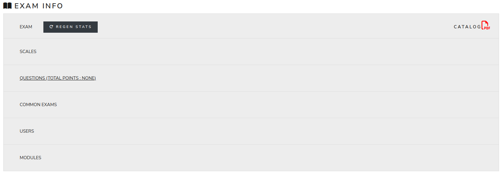
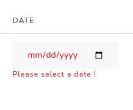
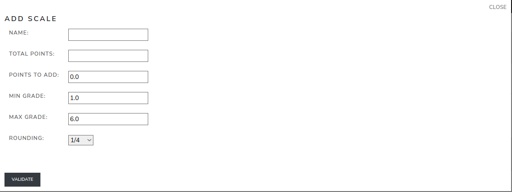
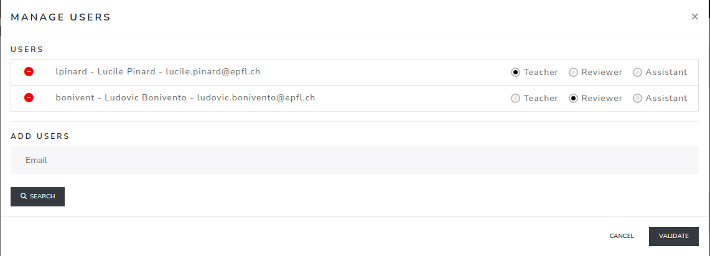
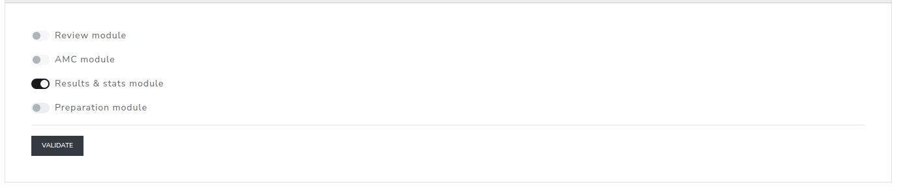

Exam info
============

The **Exam Info** page manages the main settings of an exam. It is usually the first page to check after opening or creating an exam.

The page is organized into six sections:

- **Exam** for code, name, year, semester and date;
- **Scales** for grading scales and final scale selection;
- **Questions** for question type, answer count and maximum points;
- **Common Exams** for shared exams;
- **Users** for exam access and roles;
- **Modules** for enabling Review, AMC, Results and Statistics, and Preparation.

.. screenshot TODO: Refresh the global Exam Info screenshot so it shows the current accordion sections and action buttons.

Exam
^^^^
The **Exam** section contains the exam code, name, year, semester and date. Use **Validate** to save changes.

The catalog PDF can be opened from this section when it is available. Use **Regen stats** after changing information that affects results or statistics.

.. screenshot TODO: Refresh if the Exam section should show current fields, catalog PDF action and Regen stats.

Scale
^^^^^
The **Scales** section lists the available grading scales. A scale has a name, total points and optional points to add.

Use the green **+** button to add a scale. One scale can be marked as final; this final scale is used when exporting or displaying final results. For common exams, the application can apply the selected final scale to all common exams or only to the current one.

.. screenshot TODO: Refresh so the scale table includes final scale selection and delete/add actions.

Questions
^^^^^^^^^
The **Questions** section is used to manage question metadata imported from AMC or configured in the app:

- question type;
- number of answers for multiple-choice and true/false questions;
- maximum points.

For overall/common exams, a question can also be included or removed from the common part. Removed common questions are displayed with a strikethrough.

After changing questions, regenerate statistics.

Common Exams
^^^^^^^^^^^^
The **Common Exams** section links several individual exams into an overall exam. Available exams must have a compatible code, the same year and semester, and imported question data.

For individual exams already linked to a common exam, common exam management is done from the overall/common exam.

Users
^^^^^
The **Users** section manages exam access. Existing users can be removed or assigned another role. New users are added by searching for their email address.

The search uses both the LDAP directory and the application database. If the user is not an EPFL member, contact the eXamc administrator.

Roles determine which sidebar modules and actions are available to the user.

.. screenshot TODO: Refresh so the user role radio buttons and LDAP/app search flow are visible.

Modules
^^^^^^^
The **Modules** section controls which major workflows are enabled for the exam:

- Review module;
- AMC module;
- Results and stats module;
- Preparation module.

Only enabled modules appear in the sidebar, and only for users with the corresponding permissions.

.. screenshot TODO: Refresh so all current module switches are visible.

