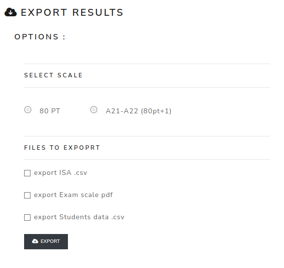

Export data
=============

The **Export results** page exports result data after statistics have been generated.

Select the scale to export. For overall/common exams, select the exams that must be included. Then choose the files to generate:

- ISA CSV;
- exam scale PDF;
- student data CSV.

If no data is available, import result data and generate statistics first.

.. screenshot TODO: Refresh so scale selection, common exam selection and export file checkboxes are visible.

