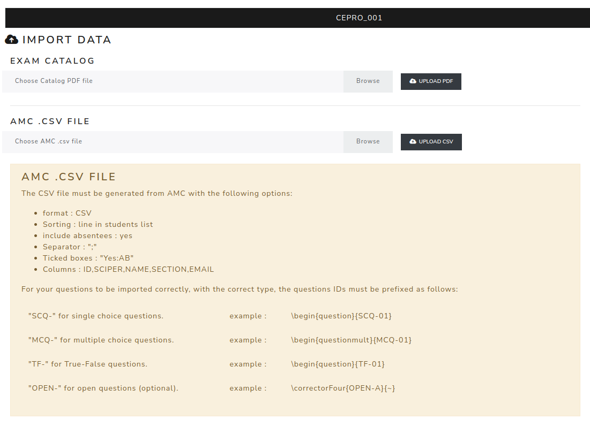

Import data
=============

The **Import data** page imports result data for the Results and Statistics modules.

Two files can be uploaded:

- the exam catalog PDF from AMC;
- the AMC CSV results file.

The AMC CSV file must be generated with:

- format: CSV;
- sorting: line in students list;
- include absentees: yes;
- separator: ``;``;
- ticked boxes: ``Yes:AB``;
- columns: ``ID,SCIPER,NAME,SECTION,EMAIL``.

For questions to be imported with the correct type, question identifiers should use the expected prefixes:

- ``SCQ-`` for single-choice questions;
- ``MCQ-`` for multiple-choice questions;
- ``TF-`` for true/false questions;
- ``OPEN-`` for open questions.

.. screenshot TODO: Refresh so both upload blocks and the current AMC CSV requirements warning are visible.

