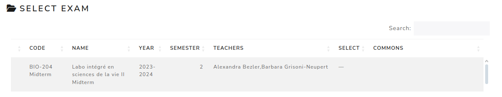

Open exam
============

The **Open exam** page lists the exams available to the current user.

Use this page when the exam is not visible in the Dashboard or when you need to browse a larger list of exams. The table can be sorted by its columns and includes pagination. Click an exam row to open that exam.

The Dashboard remains the fastest entry point for recent exams and pending actions.

.. screenshot TODO: Refresh this screenshot if the Select Exam table styling or columns changed after the Dashboard update.

