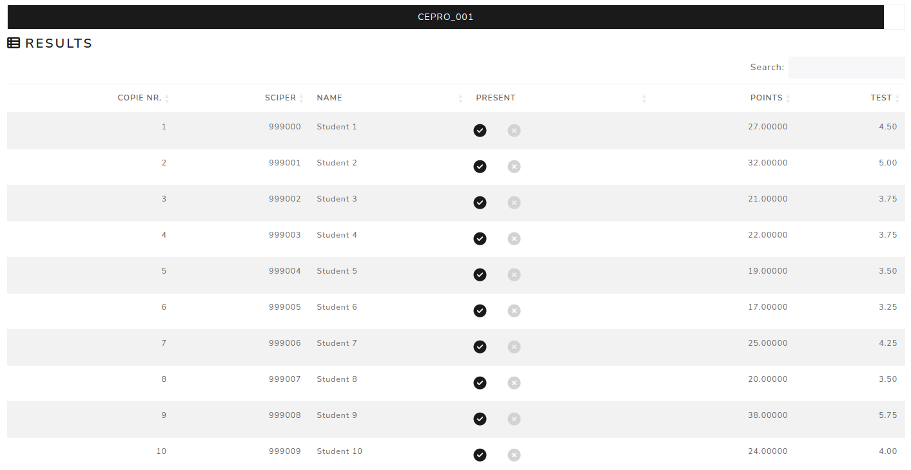

Results
==========

The **Results** page gives an overview of student results for the selected exam.

The table lists copy number, SCIPER, student name, presence status, points and grades for each configured scale. The final scale is marked with a check icon.

Use the presence controls to mark a student as present or absent. If no result data is available yet, import data and generate statistics first.

.. screenshot TODO: Refresh so the current presence controls, final scale indicator and no-data warning are represented.

