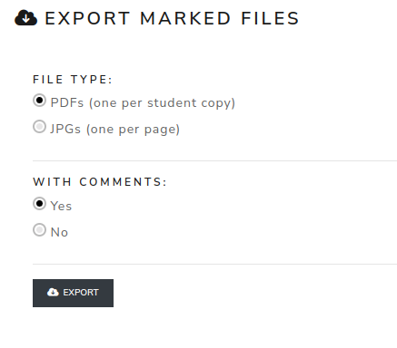

Export marked files
===================
The **Export marked scans** page exports the corrected scans produced in Review.

#. Choose the export file type.
#. Choose whether comments must be included.
#. Click **Export**.

The export is useful before replacing scans or deleting old Review data.

.. screenshot TODO: Refresh if export type or comments options changed.

