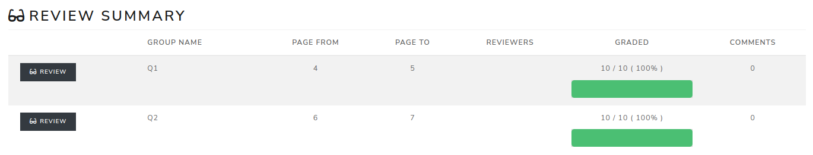
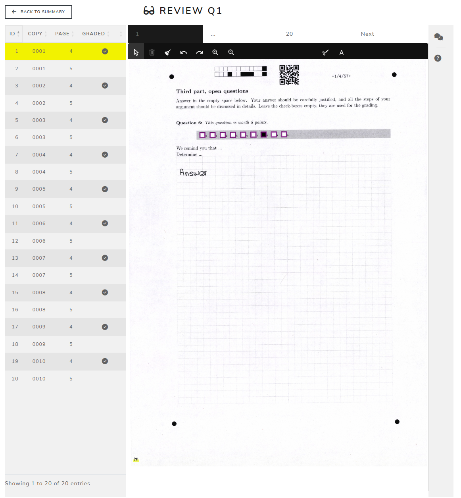

Review
======

The **Review** page is the entry point for correcting open questions.

Review summary
--------------

The Review summary lists the pages groups assigned to the current user. Each row shows the group name, the number of pages, the assigned reviewers, the grading progress and the number of comments.

Click **Review** on a row to open the correction screen for that pages group.

.. screenshot TODO: Refresh this screenshot so it shows the current Review Summary columns, reviewer progress badges and comments count.

Correction screen
-----------------

The correction screen is split into three main areas:

- the left table lists the copies and pages in the selected pages group;
- the center area displays the scanned page and the annotation toolbar;
- the right area contains the grading schemes when they are enabled for the pages group.

Use **Back to Summary** to return to the Review summary.

Navigation and locks
--------------------

The correction screen displays navigation hints above the scanned page:

- left and right arrows move between pages;
- up and down arrows move between students.

The copy/page list also indicates whether a page is already graded and whether comments exist. A lock icon can appear when another reviewer is currently working on the same page.

Annotation tools
----------------

The toolbar above the scan contains the main correction tools:

- select an existing annotation;
- add text;
- draw a rectangle;
- draw freehand annotations;
- clear annotations;
- magnify the scan;
- choose an annotation color.

The page is considered graded when a correction box or grading marker has been marked.

Discussion and grading help
---------------------------

The discussion button opens a modal used to exchange comments about the current copy and pages group.

Grading help configured in **Review -> Settings -> Pages groups** is shown during review to guide the corrector.

Grading schemes
---------------

When the pages group uses grading schemes, the right panel displays the available schemes. Select the relevant scheme, then check the predefined items that match the student's answer. The selected checkboxes determine the points for the question.

If the current page is not linked to the pages group, the grading scheme panel is blocked until the reviewer returns to a valid page.

.. screenshot TODO: Refresh this screenshot so it shows the current correction toolbar, shortcuts hint, comments modal entry and grading scheme panel.

Blocked review or missing scans
-------------------------------

If a reviewer is blocked for the exam, the page displays a warning and correction is disabled. If no scans have been uploaded yet, the correction screen displays a **No scans uploaded** warning.
