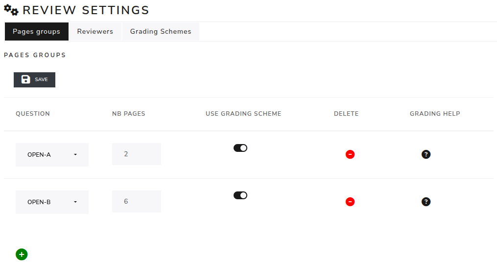
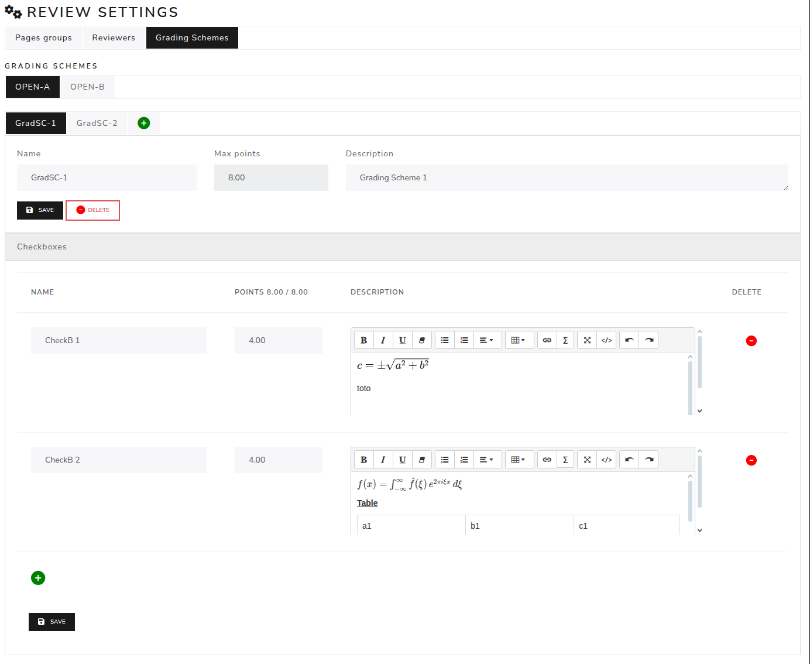
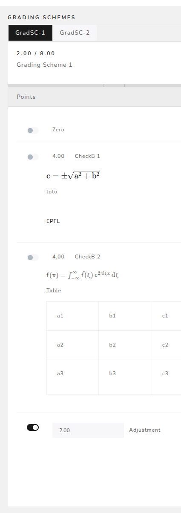

##############################
Grading schemes
##############################

Review Settings - Grading schemes :

Grading schemes are a way of marking exams by adding predefined points. The corrector simply clicks on them.
Different grading schemes can be used to provide multiple ways of marking the exam.

To use the Grading Scheme module:
In the 'Pages groups' tab, select the 'Use Grading Scheme' button and go to the Grading Scheme tab. Then click on the "save" button.

In the "Grading Schemes" tab appears the open questions that are in the exam (first tabs).
It is possible to add multiple grading schemes by clicking on the green button "+".
After that steps should be done :

- Frist name the type of grading scheme. The maximum points are automatically write.
- Write the description of the grading (the way it will be corrected).
- Save the modifications with the "save" button.

Review settings - checkboxes :

These are separate answers. Each one has a name, points and a description.

To add a checkbox, click on the green button "+" at the bottom. To create a checkbox:

- First, name the checkbox.
- Then, give the points, which should total the maximum number of points. Zero points are set automatically and are visible during corrections.
- Finally, write the answers in the description (LaTeX can be used to format the answers).

During the correction :

The checkboxes are displayed as follows:

The Zero points are set by default, the answers gave, and the adjustments.
These are points that can be awarded by the corrector if the answer is incomplete but some parts are correct.