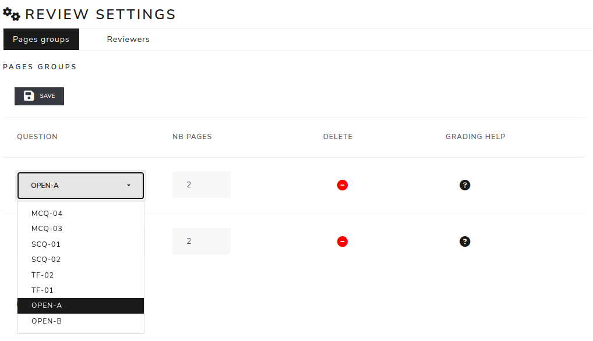

Pages groups
------------

Review Settings - Pages Groups

It is composed by a "+" button, a "save" button and a table with many entries.
The first one, "GROUP NAME", is dedicated to give the name of the question.
The next two entry are used to apply the numbers of pages that contain the question.

The last entries in the tree are buttons.The first one, "DELETE", is used to remove the question.
The next one is "GRADING HELP" for leaving comments on how correct the question is.
The last one, is dedicated to detect the corrector boxes.

After making changes, use the "save" button.

