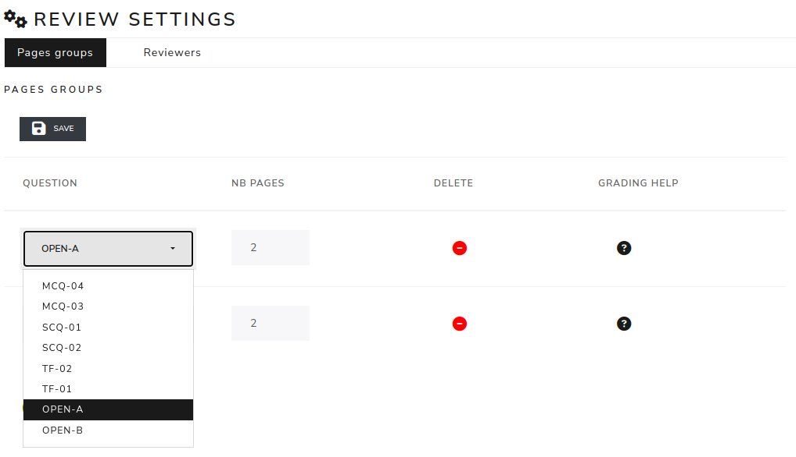
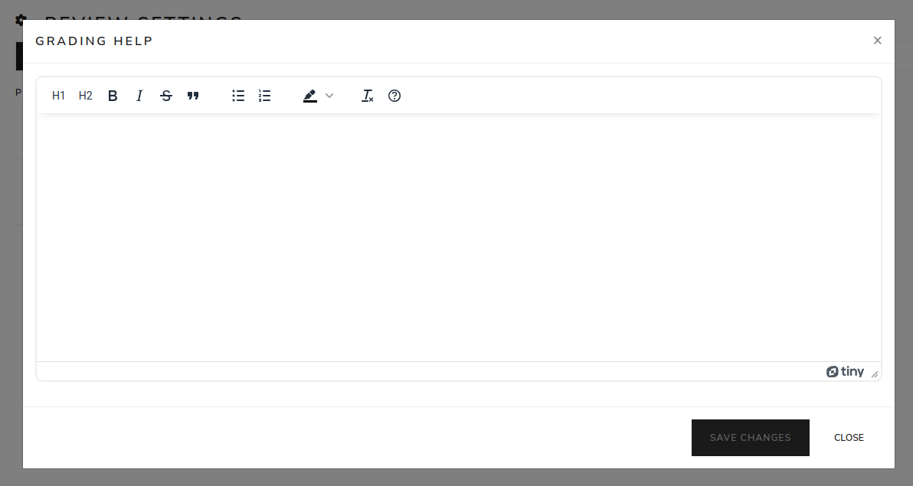

Pages groups
------------

The **Pages groups** tab defines which exam pages belong to each open question reviewed online.

The table contains one row per pages group. Each row lets you select the question, set the number of pages and decide whether the group uses grading schemes.

Use:

- **Save** to store changes;
- the green **+** button to add another pages group;
- **Delete** to remove a pages group that has not been used yet;
- **Grading Help** to write correction instructions for reviewers.

After making changes, click **Save**.

Locked pages groups
^^^^^^^^^^^^^^^^^^^

When review data already exists for a pages group, the group is locked. A locked group cannot be deleted, and its question, number of pages and grading scheme mode cannot be changed. The grading help can still be edited.

Review data includes annotations, comments, grading scheme choices and student report notes.

.. screenshot TODO: Refresh so locked rows, status column, Use Grading Scheme switch and add/delete actions are visible.

Review settings - Grading Help
^^^^^^^^^^^^^^^^^^^^^^^^^^^^^^

The **Grading Help** button opens an editor used to write instructions for the correctors. The editor supports formatted text, lists, links, images and formulas. These instructions are displayed during the correction process.

.. screenshot TODO: Refresh if the current Quill toolbar or modal layout differs from this image.

