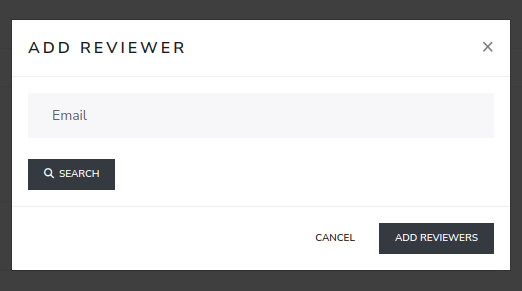

##############################
Reviewers
##############################

Review Settings - Reviewers

It consists of a "+" button, a "save" button and a table with many entries.The "+" button helps to add the new reviewer.
A pop-up box will appear with an empty field where it's possible to type in the email address of the reviewer you are looking for. The search is done in the ldap
database and in the app database, if your reviewer is not an EPFL member, please contact eXamc admin.

The entry "USER" is the name of the reviewer, this is also a selector to easily change the reviewer. The second entry, "PAGES GROUPS", is used to
to assign the question bank to the reviewer. The last one, the "DELETE" button, is used to remove the reviewer from the question.

After making changes, use the "save" button.

.. image:: images/review_reviewer.png
  :width: 600