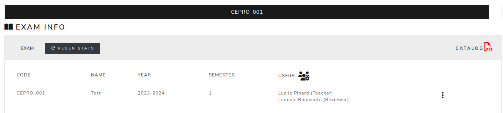
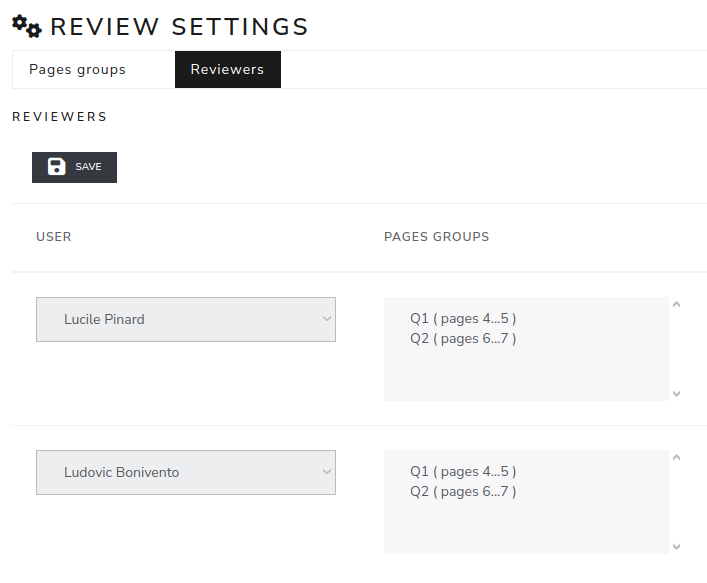

##############################
Reviewers
##############################

The **Reviewers** tab assigns reviewers to the pages groups they must correct.

Before a reviewer can be assigned here, the user must be added to the exam in **Exam Info**. Open the users dialog, search for the reviewer by email address and add the user with the appropriate role.

The search uses both the LDAP directory and the application database. If the reviewer is not an EPFL member, contact the eXamc administrator.

.. screenshot TODO: Refresh if the Exam Info user search modal changed.

In Review settings, use:

- **User** to select the reviewer;
- **Pages groups** to select the groups assigned to that reviewer.

Click **Save** after changing assignments.

.. screenshot TODO: Refresh if reviewer assignment now shows different roles, pages groups or save controls.

