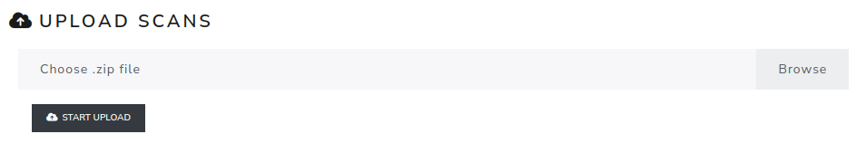

Upload scans
==============

The **Upload scans** page imports the scanned exam pages used by online Review.

This step must be done after importing the AMC project. The AMC project must also be valid: working documents must be generated and layout detection must have processed the pages. If these checks are not ready, the page displays a warning explaining which AMC actions are required.

The uploaded file must be a ``.zip`` archive.

Delete old data
---------------

The upload form contains a **Delete old data before upload** switch. Enable it only when the previous Review scans and their related review data must be removed.

When this option is enabled, old scans, annotations and comments related to them are deleted before the new import.

.. screenshot TODO: Refresh so the AMC readiness warning and Delete old data switch are visible.

.. warning::

   Before deleting old data, export marked scans from **Review -> Export marked scans** if you need to keep a record of existing annotations and comments.
