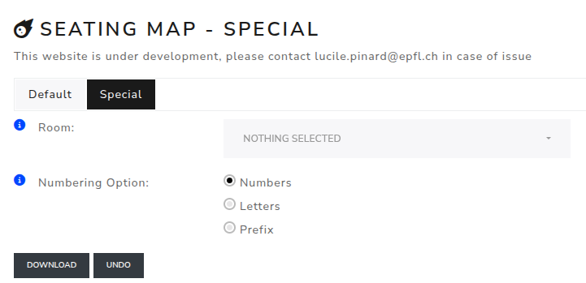

Seating plan special
======================

This room plan generator is used to create special plans with special numbers. Three options are available :

- Numbers
- Letters
- Prefix

It's a point a click online plan.
Frist choose a plan. Then choose the way of numbering.
After, you can click to select the point wanted.

The number option go from 1 to infini.
The letters option go from A to Z and then from AA to ZZ etc...
The prefix option is used to add a prefix before a number (like A-1, F-2,...).

If the prefix or the option change the numbering restart at 1.

