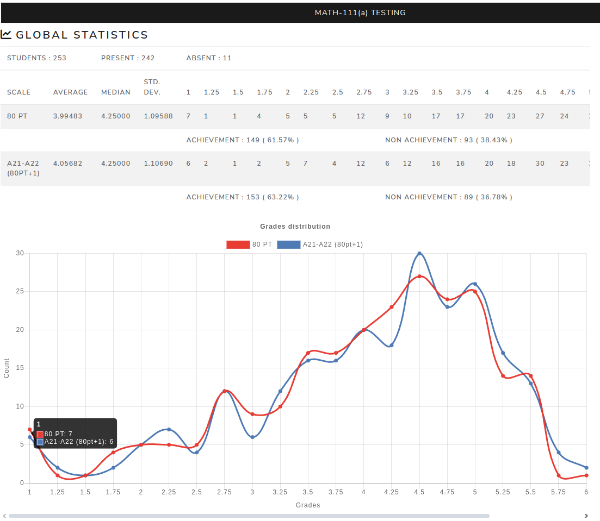

Global statistics
=======================

The **Global statistics** page displays grade distributions and summary values for the selected exam.

For a single exam, the page shows the global distribution by scale, including average, median and standard deviation.

For an overall/common exam, additional tabs can compare:

- common results;
- results by exam;
- results by section;
- common versus individual parts;
- common versus individual correlation, when correlation data is available.

Multiple scales can be displayed when several scales are configured.

.. screenshot TODO: Refresh so overall/common exam tabs and current chart styling are visible.
