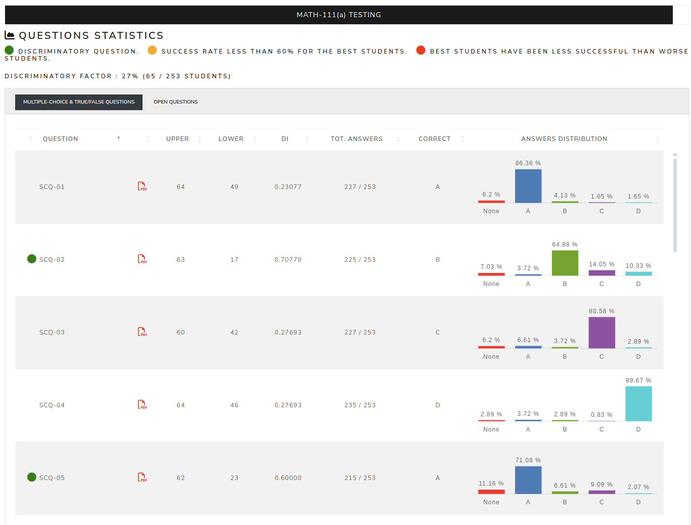
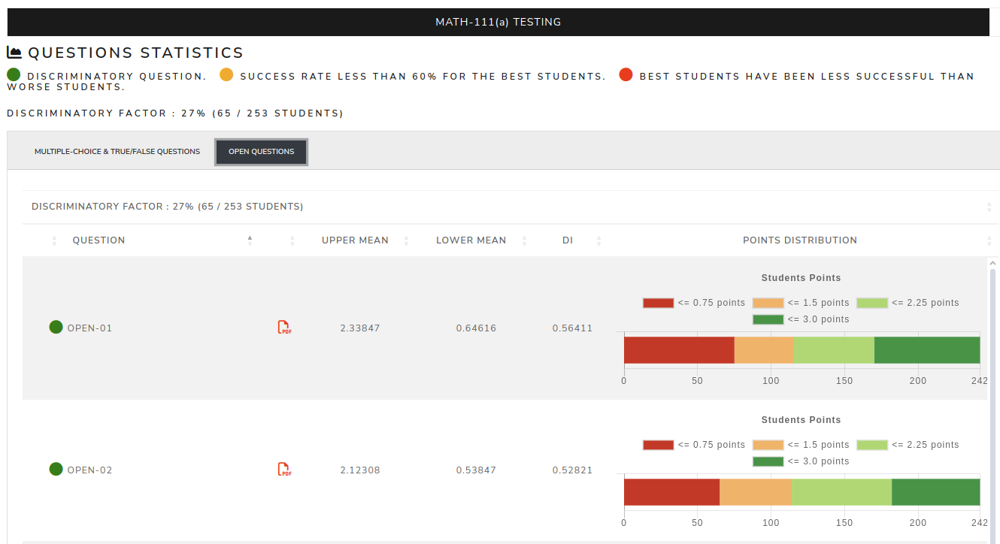

Statistics per questions
=========================

The **Questions statistics** page displays statistics for each question. It is divided into two sections:

#. Multiple-choice & True/False questions
#. Open questions

MC & TF questions
------------------

For multiple-choice and true/false questions, the page shows the distribution of selected answers. For overall/common exams, it can also compare distributions by exam.

.. screenshot TODO: Refresh so MC/TF chart/table presentation matches the current page.

Open questions
----------------

For open questions, the page shows score distributions by point ranges. This helps identify questions with unusual marking patterns or point distributions.

.. screenshot TODO: Refresh so open-question distribution presentation matches the current page.

